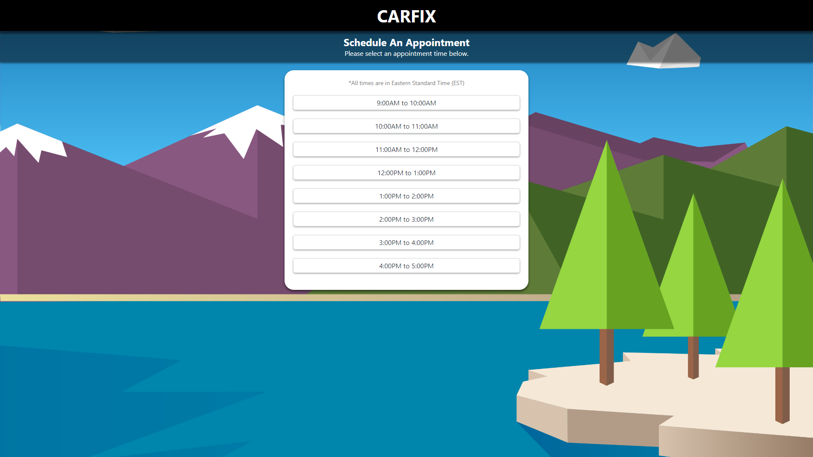
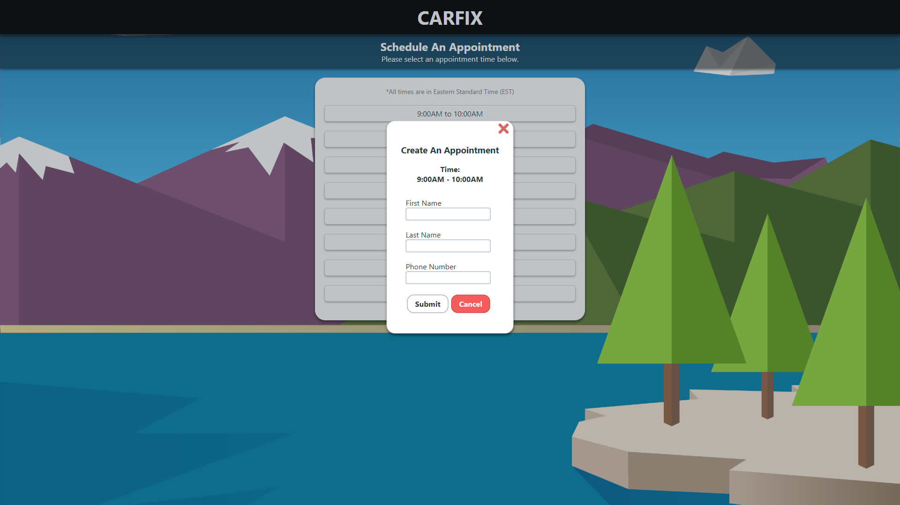
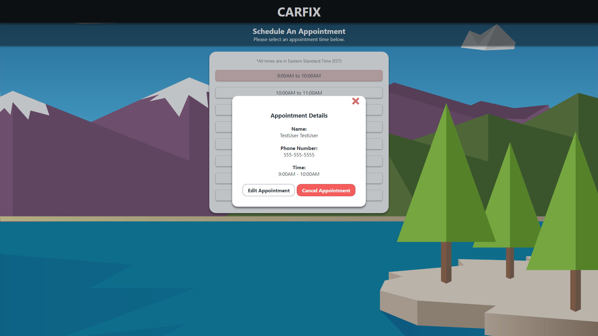

# CARFIX

## Table of Contents
- [Live Site](#live-site)
- [Run Locally](#run-locally)
- [Tech Stack](#tech-stack)
- [Goals](#goals)
- [Server Repo](#server-repo)
- [Components](#components)
- [Screenshots](#screenshots)

## Live Site
[CARFIX](https://stark-fjord-78742.herokuapp.com/ "CARFIX")

## Run Locally
### Instructions
1) Clone this repo
2) `npm i` to install dependencies
3) `npm start` to run the client  
(**CARFIX server and MongoDB must be running for full functionality**)

## Server Repo
[CARFIX Server Repo](https://github.com/gyuhankim/scheduling-app-server "CARFIX Server Repo")

## Tech Stack
* React
* Redux

## Goals
### The goals for CARFIX is to:
1) Display hour long time slots from 9AM to 5PM
2) Allow user to select a time slot and schedule an appointment
3) Allow user to edit an existing appointment

## Components
Component | Purpose |
--- | --- |
App | Main component responsible for routing |
Dashboard | Display component, serves as a landing page |
Form | Redux-Form component, responsible for user contact information input and transmitting to server |
Modal | Pop-up display containing the Form component or existing appointment information |
Schedule | Responsible for displaying a list of TimeSlot components |
TimeSlot | Displays available/unavailable appointment times |

## Screenshots
### Landing Page

### Appointment Form & Modal

### Form Validation

### Timeslot Unavailable

### Edit Appointment & Modal
